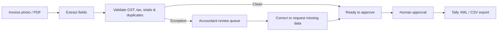
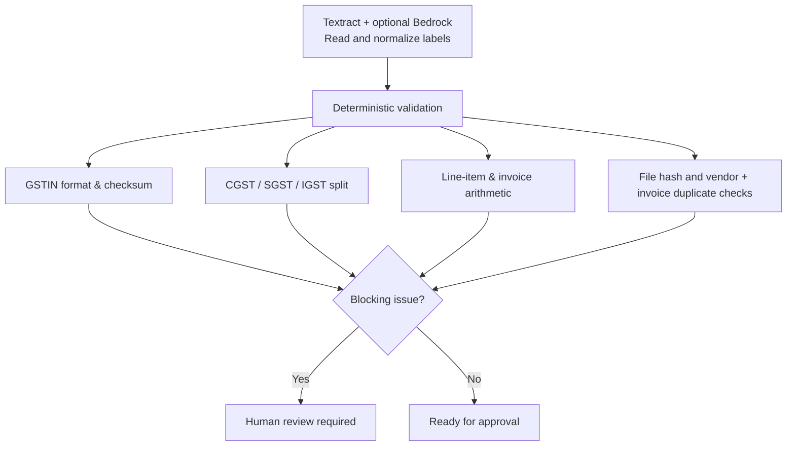
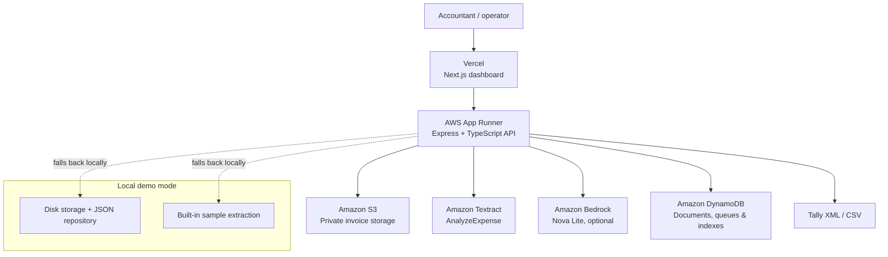

# LedgerFlow

### AI-assisted invoice review for Indian accounting teams

**Built by Team Logorhythms for the Claude Impact Lab Hackathon**

> **Do not type every invoice. Review the unclear ones.**

LedgerFlow turns supplier invoice photos and PDFs into validated, export-ready accounting entries. It combines document intelligence with deterministic GST and arithmetic checks, then routes only exceptions to an accountant for approval.

<p align="center">
  <a href="#the-problem">Problem</a> | <a href="#our-solution">Solution</a> | <a href="#how-it-works">Architecture</a> | <a href="#run-locally">Run locally</a> | <a href="#deployment">Deploy</a>
</p>

---

## The problem

CA firms, distributors, and small manufacturers receive invoices through WhatsApp, email, shared drives, and paper scans. Every document creates the same slow loop: open it, type supplier and tax data into Excel or Tally, recheck totals, chase missing details, and fix errors at filing time.

Generic OCR can read text, but accounting teams need trustworthy validation, a clear exception queue, and control over what is posted.

## Our solution

LedgerFlow is an **accounting workflow**, not a chatbot. It extracts structured fields, applies deterministic checks, and keeps a human in control before any export.

| Instead of | LedgerFlow enables |
| --- | --- |
| Typing every invoice | Reviewing only invoices that need attention |
| Trusting raw OCR | Validating GSTIN, totals, tax splits, and duplicates |
| Hunting through chats for missing fields | Drafting a clear vendor follow-up message |
| Copying data into accounting software | Exporting approved entries to Tally XML or CSV |

### Workflow



## What we built

- **Invoice inbox** for JPG, PNG, and PDF uploads with live processing status.
- **Extraction pipeline** for vendor data, GSTIN, invoice identifiers, dates, line items, taxes, and totals.
- **Exception-first review** for missing data, weak extraction, tax/total mismatches, invalid GSTINs, and duplicate invoices.
- **Side-by-side review** of the original document and editable fields.
- **Human approval gate**: entries cannot export until blocking issues are resolved.
- **Audit trail** for extraction, corrections, approvals, and exports.
- **Accounting-ready outputs**: CSV and Tally-compatible XML.

## Why it is trustworthy

AI is useful for reading invoices with different layouts and scan quality; it should not invent financial facts. LedgerFlow separates document understanding from financial validation.



- Uncertain values are treated as missing—not guessed.
- Original invoice files remain private.
- Bedrock only normalizes labels and explanations; it does not decide accounting values.
- Nothing exports without human approval.
- Every material action lands in the audit trail.

## How it works



The adapter design lets the entire workflow run on a laptop without AWS. In production, the same API switches to S3, DynamoDB, Textract, and optionally Bedrock. `GET /health` reports which adapters are active.

## Tech stack

| Layer | Technology |
| --- | --- |
| Frontend | Next.js 16, React 19, TypeScript |
| Backend | Express, TypeScript, Zod |
| OCR | Amazon Textract `AnalyzeExpense` |
| AI normalization | Amazon Bedrock Nova Lite (optional) |
| Storage | Amazon S3, with local-disk fallback |
| Data | Amazon DynamoDB, with JSON-repository fallback |
| Hosting | Vercel + AWS App Runner |

## Demo flow

1. Open the inbox and select a sample invoice or upload a document.
2. Inspect the extraction result and validation status.
3. Open a flagged item to compare the original document and extracted fields.
4. Correct a field or use the generated missing-information reminder.
5. Save, approve, and export the completed entry as Tally XML or CSV.

The seeded demo covers missing GSTIN, total mismatch, duplicate resend, faded print, interstate IGST, and a clean invoice that can go straight through.

## Run locally

**Prerequisite:** Node.js 22+.

Open two terminals from the repository root:

```bash
# Terminal 1 — API at http://localhost:8080
cd backend
npm install
npm run seed
npm run dev
```

```bash
# Terminal 2 — dashboard at http://localhost:3000
cd frontend
npm install
copy .env.local.example .env.local
npm run dev
```

Open [http://localhost:3000](http://localhost:3000). Without AWS, LedgerFlow uses local file storage, a JSON repository, and built-in sample extraction so the complete demo still works. On macOS/Linux, replace `copy` with `cp`.

## Deployment

| Component | Production home | Configuration |
| --- | --- | --- |
| API | AWS App Runner | `backend` directory, port `8080` |
| Dashboard | Vercel | `frontend` directory |
| Documents | Private Amazon S3 bucket | Encryption + versioning |
| Records | Amazon DynamoDB | On-demand table with review/duplicate indexes |

The frontend and backend need two matching URLs:

| Service | Variable | Value |
| --- | --- | --- |
| Vercel | `NEXT_PUBLIC_API_URL` | App Runner URL |
| App Runner | `CORS_ORIGIN` | Exact Vercel production URL, no trailing slash |

For a no-terminal AWS walkthrough, see [AWS_CONSOLE_SETUP.md](AWS_CONSOLE_SETUP.md). The technical reference is in [AWS_SETUP.md](AWS_SETUP.md).

## API overview

| Method | Endpoint | Purpose |
| --- | --- | --- |
| `GET` | `/health` | Health check and active adapter report |
| `GET` | `/api/documents` | Inbox and document stats |
| `POST` | `/api/documents/upload` | Upload an invoice file |
| `POST` | `/api/documents/demo` | Add a demo invoice scenario |
| `GET` | `/api/documents/:id` | Fetch a document and preview URL |
| `POST` | `/api/documents/:id/process` | Re-run extraction and validation |
| `PATCH` | `/api/documents/:id/review` | Save corrections, approve, or reject |
| `POST` | `/api/documents/:id/export/csv` | Export an approved CSV entry |
| `POST` | `/api/documents/:id/export/tally` | Export approved Tally XML |
| `POST` | `/api/documents/:id/reminder` | Draft a missing-field reminder |

## Project documents

- [Problem and solution](PROBLEM_AND_SOLUTION.md)
- [Implementation plan](IMPLEMENTATION_PLAN.md)
- [AWS console setup](AWS_CONSOLE_SETUP.md)
- [AWS technical setup](AWS_SETUP.md)

---

Built with care by **Team Logorhythms** for the **Claude Impact Lab Hackathon**.
