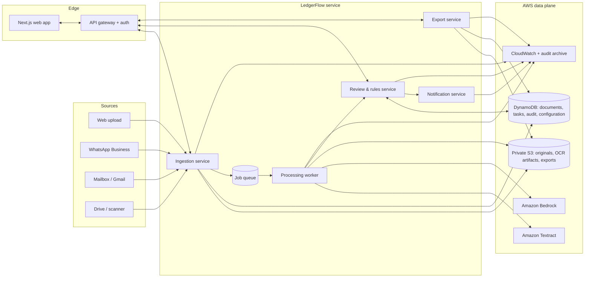
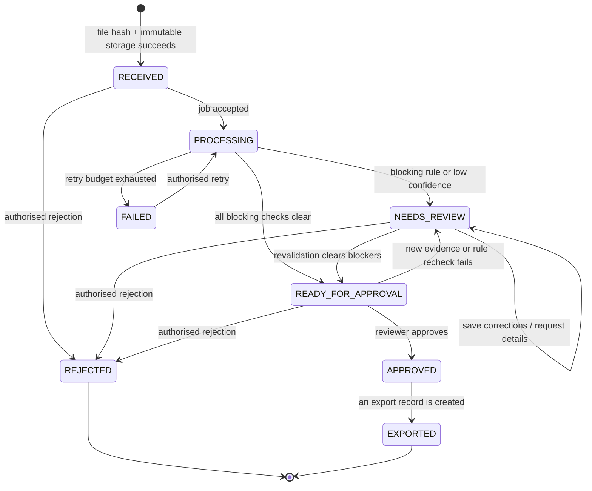
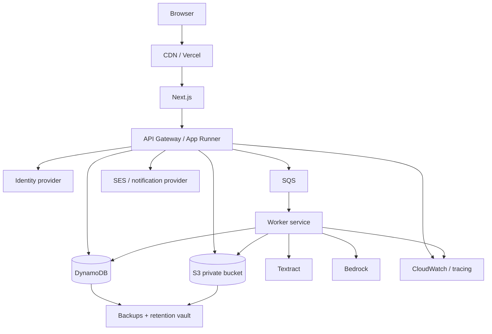

# LedgerFlow system architecture

LedgerFlow is a controlled invoice-to-accounting-entry system for Indian finance teams. Its job is not to *decide* what belongs in the books. Its job is to read incoming supplier invoices, make the evidence and validation results easy to review, and let an authorised person approve a traceable export.

This document is the production architecture for the existing prototype. The currently implemented upload, extraction, validation, review, notification and export flow is the vertical slice; the sections marked **production extension** define how it grows safely beyond a single demo organisation.

## 1. Product contract

### Primary users

| Role | Can do | Cannot do |
| --- | --- | --- |
| Intake operator | upload, see processing state, add a source label | approve, change approved records, export |
| Accountant / reviewer | correct extracted values, request information, approve or reject | alter audit history |
| Finance manager | manage review rules, exports and team access, view reporting | modify the original invoice |
| Auditor | read documents, validations, history and export evidence | change data or trigger exports |
| System worker | extract, validate, create reminders and audit its own actions | approve accounting entries |

### Non-negotiable rules

1. Original document bytes are immutable after ingestion.
2. An AI/OCR value is always an untrusted proposal until validated and, when required, approved by a human.
3. Deterministic rules—not a model—decide validation, status transitions and export eligibility.
4. Every material action is an append-only audit event with actor, time, action and relevant detail.
5. A user can only access records belonging to their organisation.
6. Approved/exported records are immutable. Corrections require a linked replacement or reversal flow.

## 2. System at a glance



The browser only talks to the LedgerFlow API. It never receives AWS credentials or direct write access to S3/DynamoDB. Downloads are served through an authorised endpoint or a short-lived, scoped presigned URL.

## 3. Component responsibilities

| Component | Responsibility | Technology now | Production extension |
| --- | --- | --- |
| Web app | Inbox, review surface, uploads, exports, role-aware actions | Next.js 16 | Vercel or CloudFront + Next.js |
| API | Authentication, organisation resolution, command validation, read models | Express + TypeScript | API Gateway/App Runner or ECS service |
| Ingestion | Store file, hash it, create document/version, enqueue processing | `DocumentService` + storage adapter | S3 event or SQS command |
| Processing worker | OCR, bounded model normalization, deterministic validation | `ExtractionService`, `ValidationService` | SQS worker with retries + DLQ |
| Rules/review | Enforce lifecycle, approval gate, assignments, audit | `DocumentService` | dedicated domain service as volume grows |
| Data store | Current document, indexes, rule set, audit metadata | DynamoDB adapter / local JSON | DynamoDB single-table + S3 artifacts |
| Object store | Originals, derived previews, raw OCR, generated exports | disk/S3 adapter | encrypted private S3 buckets |
| Exporter | Generate CSV/Tally XML and record exactly what was exported | `exportService` | connector outbox + idempotency keys |
| Notifications | Email request/decline messages, future WhatsApp | `EmailService` | SES + WhatsApp Business provider |
| Observability | structured events, metrics, alerts, retention | logger | CloudWatch, X-Ray/OpenTelemetry, SIEM |

## 4. Core domain model

Use a tenant-scoped identifier everywhere. `orgId` must be resolved from the authenticated session, never from an untrusted request parameter.

```text
Organisation 1 ─── * Member
Organisation 1 ─── * Vendor
Organisation 1 ─── * Document
Document    1 ─── * DocumentVersion
Document    1 ─── * ValidationRun
Document    1 ─── * ReviewTask
Document    1 ─── * AuditEvent
Document    1 ─── * ExportRecord
DocumentVersion 1 ─ * SourceArtifact
```

### Document aggregate

| Field | Meaning |
| --- | --- |
| `documentId`, `orgId` | immutable business and tenant identifiers |
| `status` | current lifecycle state, controlled only by the domain service |
| `source`, `receivedAt`, `storageKey`, `fileHash` | immutable intake evidence |
| `activeVersionId` | current extraction/review version |
| `fields` | normalized structured invoice fields; nullable when unknown |
| `confidence` | extraction confidence, not accounting certainty |
| `exceptions` | current deterministic rule results |
| `fingerprint` | vendor + GSTIN + invoice number duplicate key |
| `assignedTo`, `dueAt`, `priority` | review-queue behaviour |
| `approvedAt`, `approvedBy`, `exportedAt` | approval/export evidence |

`DocumentVersion` stores the extraction result and reviewer edits for one processing/review cycle. The original bytes are never duplicated or overwritten. This lets an auditor answer both questions: “what did the system read?” and “what did the reviewer approve?”

### DynamoDB key design

The prototype already uses document and duplicate indexes. At production scale, retain its document item and add the following tenant-scoped records:

| Entity | PK | SK | Index purpose |
| --- | --- | --- | --- |
| Document | `ORG#<org>` | `DOC#<id>` | canonical record |
| Version | `ORG#<org>` | `DOC#<id>#VER#<n>` | immutable historical read/review version |
| Audit event | `ORG#<org>` | `DOC#<id>#AUDIT#<time>#<event>` | chronological evidence |
| Review task | `ORG#<org>` | `TASK#<status>#<priority>#<due>#<id>` | team queue |
| Export | `ORG#<org>` | `DOC#<id>#EXPORT#<id>` | downstream delivery evidence |
| Vendor | `ORG#<org>` | `VENDOR#<id>` | master data / contacts |
| Rule set | `ORG#<org>` | `RULESET#<version>` | organisation-level validation configuration |

Secondary indexes remain organisation-aware. Never create a global duplicate lookup that can disclose whether another tenant has used the same vendor or invoice number.

## 5. Lifecycle and state machine



`PROCESSING`, `FAILED`, `REJECTED` and `EXPORTED` cannot be approved. `APPROVED` and `EXPORTED` cannot be edited. A re-uploaded/corrected supplier invoice creates a new document with `replacesDocumentId`; it does not unlock the accounting evidence already exported.

## 6. End-to-end logic

### A. Intake

1. API authenticates the caller, checks the `intake:write` permission and resolves `orgId`.
2. It verifies MIME type, file signature, page count/size limits and malware scan result before permanent acceptance.
3. It calculates SHA-256 as a stream, stores the object with SSE-KMS, and creates a `RECEIVED` document plus `UPLOADED` audit event in one idempotent command.
4. A file-hash match creates a visible duplicate warning; it does not silently discard evidence.
5. The API returns `202 Accepted` with a document id and queue state, then sends a durable processing job.

### B. Extraction and normalization

1. A worker takes one job and marks it `PROCESSING` using an optimistic version check.
2. For supported image/PDF inputs it calls Textract. Multi-page PDFs use asynchronous Textract jobs with a callback/poll workflow.
3. It writes the raw OCR response to a restricted S3 artifact path with an expiration policy.
4. An optional Bedrock call receives only OCR-derived structured text. Its schema permits a normalized value, a confidence indication and explanation, but it cannot set status or approve an invoice.
5. Zod validates and normalizes the output. Invalid/ambiguous values become `null`; no value is invented.
6. The worker runs deterministic GSTIN, arithmetic, date, tax split, duplicate and policy checks.
7. It creates an immutable version, replaces the document’s current projection, appends audit events, and derives `NEEDS_REVIEW` or `READY_FOR_APPROVAL`.

### C. Human review

1. The reviewer sees the exact original document beside the current proposed fields, exceptions and full event trail.
2. A saved edit creates a new version/review event, recalculates all rules and refreshes its duplicate fingerprint.
3. “Request details” creates a tracked communication event with an approved template; it never claims delivery if the provider only accepted the message.
4. Approval uses a conditional write: only the document version the reviewer saw may be approved, and only when blocking exception count is zero.
5. Rejection is terminal for that document and can optionally issue a vendor communication. It never deletes intake evidence.

### D. Export and reconciliation

1. Export command requires `export:write`, an `APPROVED` document and an idempotency key.
2. The exporter writes a deterministic CSV/Tally XML artifact, records the checksum, format, actor, target connector and record snapshot.
3. On connector delivery, an outbox record moves through `PENDING → SENT → ACKNOWLEDGED` or `FAILED`; retries are safe because the idempotency key travels downstream.
4. An export failure never rolls an approved document back to editable. It creates an actionable delivery task.

## 7. Validation policy

Validation is a pure function of document fields, organisation rules and known duplicate records. It returns `{ exceptions, blocking, warnings, normalizedFields, reviewNote }` and has no external side effects.

| Category | Example check | Default severity |
| --- | --- | --- |
| Identity | vendor, invoice number, invoice date are present | blocking |
| GST | 15-character format, checksum, state code | blocking for GST-claiming flow |
| Arithmetic | line sum + tax matches total under organisation tolerance | blocking |
| Tax | CGST/SGST vs IGST is consistent with place of supply | blocking |
| Duplicate | identical bytes or vendor + invoice fingerprint | blocking until reviewer resolves |
| Quality | OCR low confidence, signature unclear | warning / configurable |
| Policy | future date, out-of-period invoice, supplier not approved | configurable |

Rules must be versioned. Every validation run stores `ruleSetVersion`, so a later policy change cannot rewrite the explanation for a historical approval.

## 8. API contract

All mutating routes require an authenticated user, a role/permission check, CSRF protection for browser sessions and an `Idempotency-Key` header. Every response includes `requestId` for support correlation.

| Method | Route | Command/result |
| --- | --- | --- |
| `POST` | `/v1/documents` | accept document and return `202` |
| `GET` | `/v1/documents` | paginated, server-side filtered review queue |
| `GET` | `/v1/documents/:id` | document projection plus permission-checked preview URL |
| `POST` | `/v1/documents/:id/reprocess` | enqueue authorised retry |
| `PATCH` | `/v1/documents/:id/review` | save versioned reviewer corrections |
| `POST` | `/v1/documents/:id/approve` | conditional human approval |
| `POST` | `/v1/documents/:id/reject` | terminal rejection with reason |
| `POST` | `/v1/documents/:id/info-requests` | create vendor follow-up request |
| `POST` | `/v1/documents/:id/exports` | generate/deliver a selected export |
| `GET` | `/v1/audit/documents/:id` | paginated evidence stream |
| `GET` | `/v1/metrics/overview` | permission-gated operational metrics |

The current `/api/documents` endpoints are the compatible prototype surface. Migrate behind `/v1` when authentication and multi-tenancy are introduced, retaining an API adapter during rollout.

## 9. Security, privacy and compliance controls

| Risk | Control |
| --- | --- |
| Tenant data exposure | JWT/session organisation claim, server-side tenant filter, organisation-prefixed keys, automated isolation tests |
| Unauthorised action | RBAC/permission checks plus step-up authentication for role changes and high-value export approvals |
| Invoice leakage | private S3, SSE-KMS, short-lived scoped URLs, TLS everywhere, no public buckets |
| Prompt injection in invoices | treat all document text as data; fixed model instruction/schema; no tool access from model output |
| OCR/LLM overreach | null uncertain values; deterministic gate; human approval required |
| Tampered history | append-only audit records, export snapshots/checksums, optional hash-chain + S3 Object Lock archive |
| Malware uploads | content sniffing, AV scan quarantine, size/page limits, preview sandbox |
| Secrets | Secrets Manager/parameter store, workload IAM roles, secret rotation; no credentials in browser/env artifacts |
| Retention | configurable retention per organisation; lifecycle policies for originals/OCR/export artifacts; legal hold exception |

Before processing customer data with any model service, document the chosen region, data-use terms, retention controls and the organisation’s consent/legal basis. The system should store only what it needs to provide accounting processing and auditability.

## 10. Reliability and operational design

### Durable job handling

Use SQS (or an equivalent durable queue) between ingestion and processing. Messages include `documentId`, `orgId`, `version`, `attempt`, `correlationId` and an idempotency key. Workers must be at-least-once safe: a duplicate job for an already-completed version is a no-op.

| Failure | Behaviour |
| --- | --- |
| Transient Textract/Bedrock error | exponential retry with jitter; preserve job attempt metadata |
| Bad file / unsupported content | non-retryable `FAILED` with reviewer-visible reason |
| Queue poison message | move to DLQ after configured attempts; alert operators |
| Worker dies after OCR | restart from durable job; artifact key/version makes work idempotent |
| Conditional-write conflict | reload latest version; return a conflict to the stale reviewer |
| Export connector outage | preserve approved document; retry outbox delivery; show `DELIVERY_FAILED` task |

### Metrics and alerts

Track upload-to-ready latency, extraction success rate, retry/DLQ count, low-confidence rate, blocking-exception mix, queue age, approval turnaround, export delivery success, duplicate rate and straight-through rate. Alert on stalled queue age, elevated failure rate, missing audit writes, error-budget burn and storage/access-policy changes.

Log structured JSON with `requestId`, `orgId` (or a privacy-safe hash), `documentId`, `jobId`, `actorId`, action and outcome. Do not log invoice contents, full GSTINs, signed URLs, OAuth tokens or raw provider responses.

## 11. Deployment topology



Use separate AWS accounts or at least separate IAM boundaries for development, staging and production. Production uses least-privilege service roles: API reads/writes only the necessary DynamoDB partitions and object prefixes; worker alone can invoke OCR/model services; export worker alone can call configured accounting connectors.

## 12. Delivery plan

### Already implemented in this repository

- File upload, local/S3 storage adapter and SHA-256 duplicate signal.
- Textract/Bedrock-capable extraction with local demo fallback.
- GSTIN, total, tax split, date, required-field and duplicate validations.
- Review page, immutable approval/export gate, audit events, CSV and Tally XML output.
- Local JSON repository plus DynamoDB implementation; SMTP and simulated email adapter.

### Next build milestones

1. Add authentication, roles and organisation resolution at the API boundary; remove the single `ORG_ID` deployment assumption.
2. Replace in-process `processInBackground` with SQS + worker + DLQ; add multi-page PDF async flow.
3. Add document versions, conditional writes and assignment/SLA review tasks.
4. Add malware scanning, rate limits, idempotency keys and object retention/lifecycle policies.
5. Add export outbox/connectors, reconciliation acknowledgement and organisation rule-set management.
6. Add load, tenancy-isolation, workflow and failure-recovery tests before opening the product to multiple firms.

## 13. Acceptance criteria

A production release is ready only when the following are demonstrably true:

- A reviewer cannot approve a document with a blocking exception or a stale version.
- A user from organisation A cannot list, fetch, preview or infer document information from organisation B.
- A worker retry cannot create duplicate audit entries, exports or accounting vouchers.
- An auditor can reconstruct original source, extracted values, edits, rules used, approver and exported artifact for any entry.
- Queue, OCR/model and connector failures become actionable states with alerts rather than silently disappearing work.
- Backup/restore and access revocation are tested, not merely configured.

